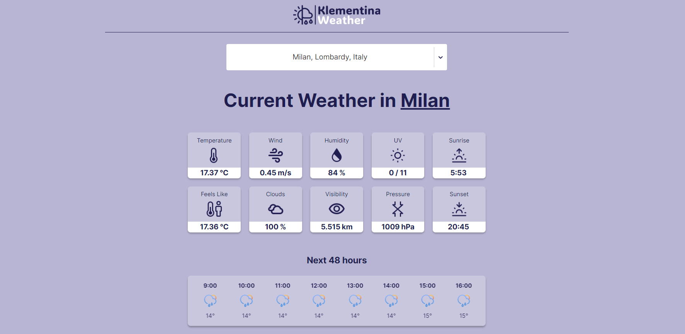

# Klementina Weather

### About:
A simple and convenient weather application with a modern interface. It utilizes two API requests — one for accessing a worldwide city database and another for fetching weather data for a specific city. Users input their desired location and can then view detailed weather information for the current moment, the next 48 hours, or the upcoming 7 days.

### Demo:

### Technologies Used:

### Packages Used:
- [React Grid System](https://www.npmjs.com/package/react-grid-system) 
- [axios](https://www.npmjs.com/package/axios) 
- [Flicking](https://www.npmjs.com/package/@egjs/react-flicking) 

### Other Links:
- [Weather API](https://openweathermap.org/api)
- [Geocoding API](https://geocode.maps.co/) 
- [Figma project](https://www.figma.com/design/NRoFcFn4KyiN1OkHTXtjk5/WeatherApp?node-id=0%3A1&t=bikgDvKdCTIyRedY-1)
- [Icons](https://www.figma.com/design/QbGCHHUf3ZUI849hxziueR/Weather--Icons-Kit-(Community)?m=dev&node-id=0%3A1&t=BwiAtHwK651yfz87-1)

